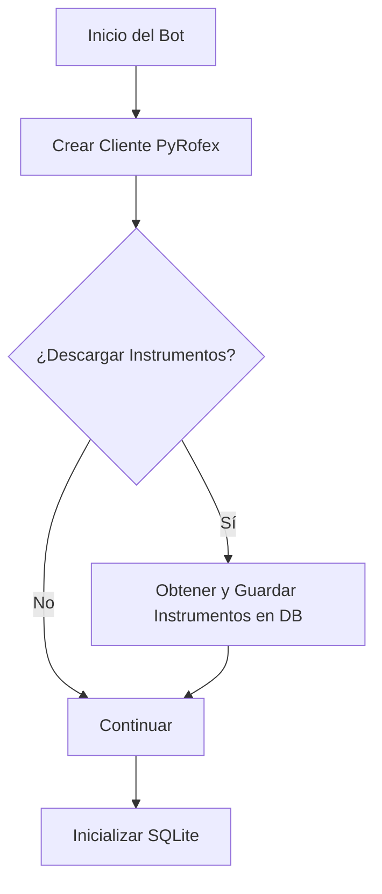
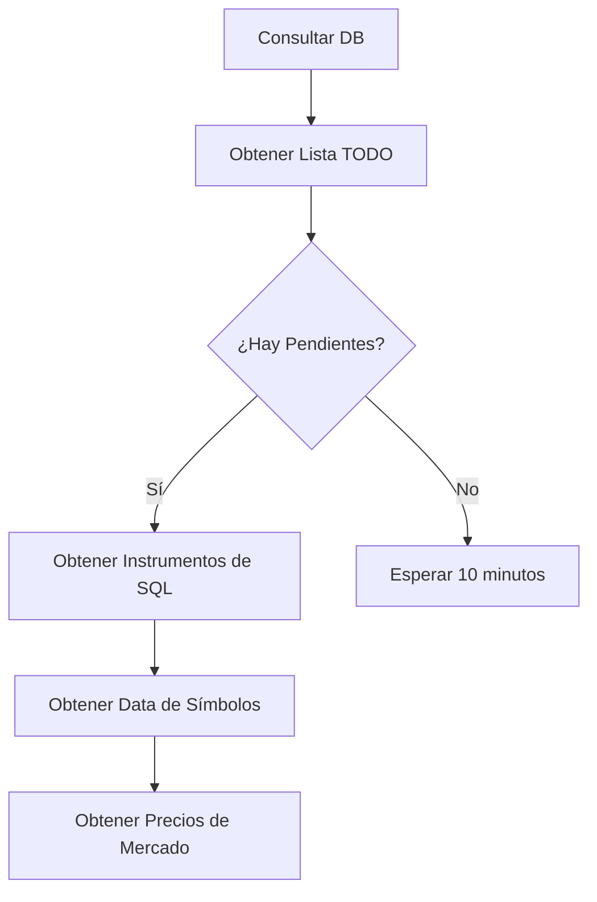
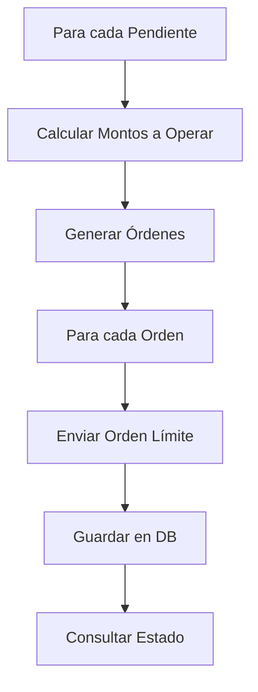
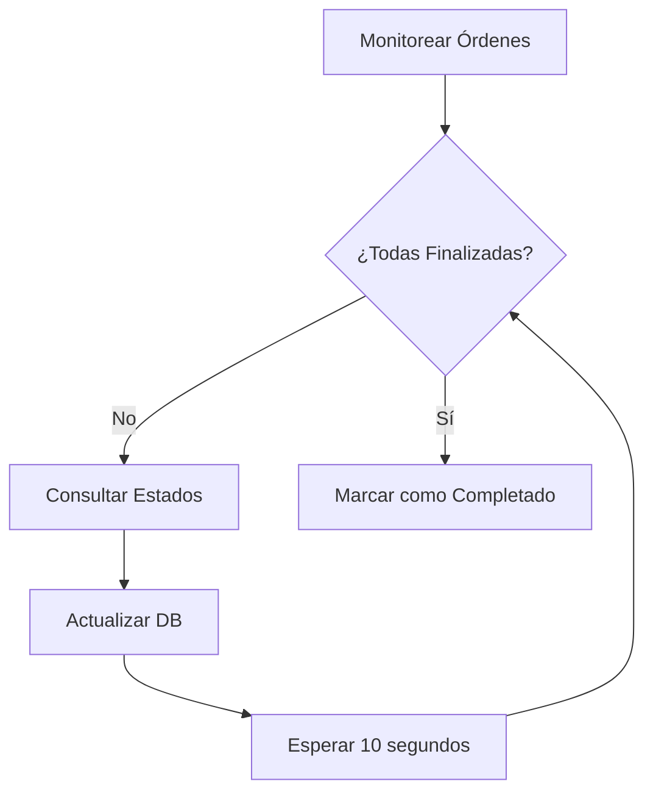

# Bot de Trading - Documentación de Flujo

Este documento describe el flujo de operación de un bot de trading que opera en el mercado de futuros.

## Índice
- [Descripción General](#descripción-general)
- [Diagrama de Flujo](#diagrama-de-flujo)
- [Componentes Principales](#componentes-principales)
- [Detalles de Implementación](#detalles-de-implementación)

## Descripción General
El bot está diseñado para ejecutar operaciones de trading de manera automatizada, gestionando órdenes y monitoreando su estado en tiempo real.

## Diagrama de Flujo

### 1. Inicialización y Configuración


### 2. Verificación de Operaciones Pendientes


### 3. Procesamiento de Órdenes


### 4. Monitoreo y Actualización


## Componentes Principales

### 1. Gestión de Instrumentos
- Sistema de descarga y actualización de instrumentos disponibles
- Almacenamiento en base de datos SQLite
- Actualización periódica de información

### 2. Gestión de Órdenes
- Procesamiento de órdenes pendientes
- Cálculo de montos y precios
- Envío de órdenes límite
- Sistema de monitoreo de estados

### 3. Persistencia de Datos
Utiliza SQLite para almacenar:
- Lista de instrumentos
- Órdenes activas
- Estados de operaciones
- Histórico de transacciones

### 4. Control de Flujo
- Ciclo principal de ejecución cada 10 minutos
- Monitoreo continuo de órdenes pendientes
- Actualización en tiempo real de estados
- Sistema de manejo de errores

## Detalles de Implementación

### Dependencias Principales
```python
from clase_primary.clase_pyrofex import PyRofexClient
import fx_sqlite
import functions
import pyRofex
```

### Funciones Clave
1. **run_bot()**
   - Función principal que inicia el ciclo del bot
   - Gestiona la lógica principal de operación

2. **Gestión de Base de Datos**
   - `main_sqlite()`: Inicialización de la base de datos
   - `create_connection()`: Conexión a SQLite
   - Funciones de consulta y actualización

3. **Procesamiento de Órdenes**
   - Cálculo de montos
   - Envío de órdenes
   - Monitoreo de estados

### Ciclo de Operación
1. Inicialización del sistema
2. Verificación de pendientes
3. Procesamiento de órdenes
4. Monitoreo continuo
5. Actualización de estados
6. Espera y reinicio del ciclo

## Consideraciones de Uso
- Asegurarse de tener todas las dependencias instaladas
- Configurar correctamente las credenciales de acceso
- Monitorear los logs del sistema
- Realizar pruebas en ambiente de desarrollo antes de producción